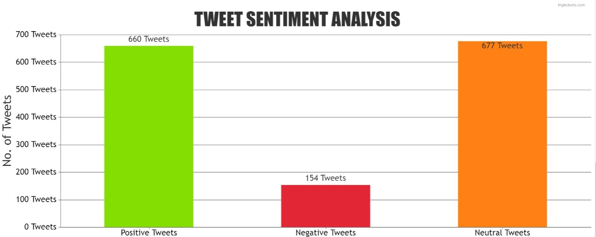
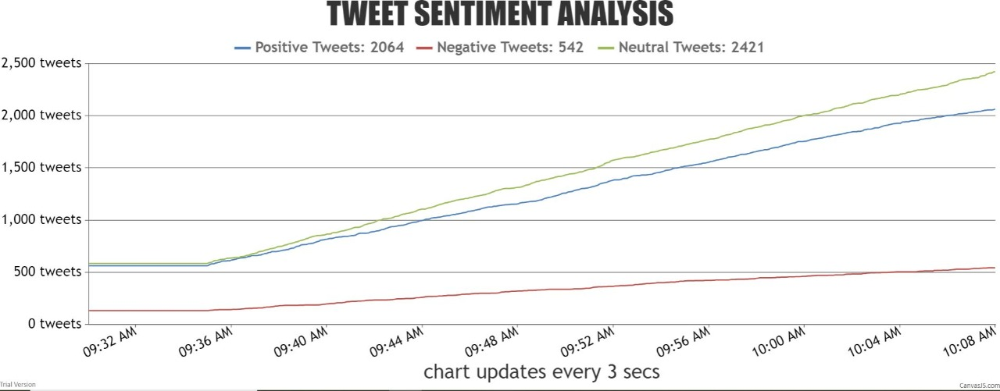
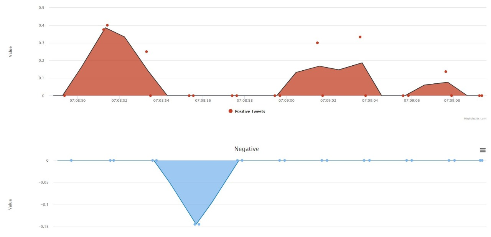
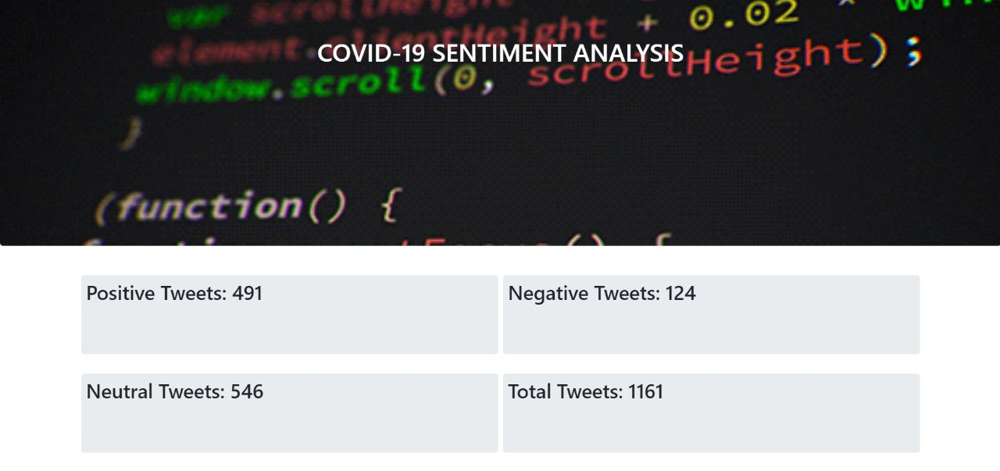

# SBSPS-Challenge-4465-Sentiment-Analysis-of-COVID-19-Tweets-Visualization-Dashboard

This Contains 2 different Modules 
the working of those modles are completly diffrent 
Model 1 requires flask for visualization
Model 2 requires IBM Watson for visualization 

<h1>Dynamic Visualisation of our dashboard</h1>

